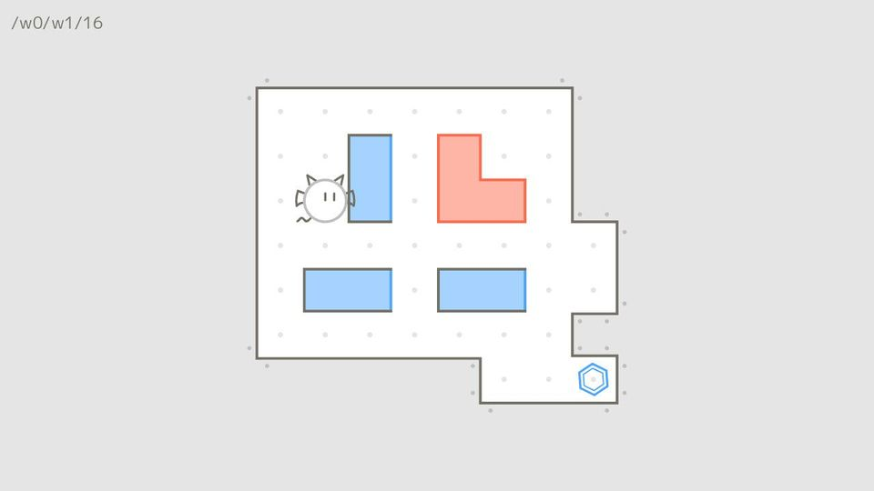

  

Maxwell's Puzzling Demon的Web端版本, 一款与热力学相关的解谜推箱子游戏

[原作可以在steam上购买](https://store.steampowered.com/app/2770160/_/)

计划实现的功能:
- [x] 基本的移动和推箱子操作
- [x] 冷热块及热传导
- [ ] 隔热墙
- [x] 撤销/恢复/重置功能
- [ ] 鼠标点击自动寻路
- [ ] 提示/参考答案
- [ ] 简单的关卡编辑器
- [ ] ...
